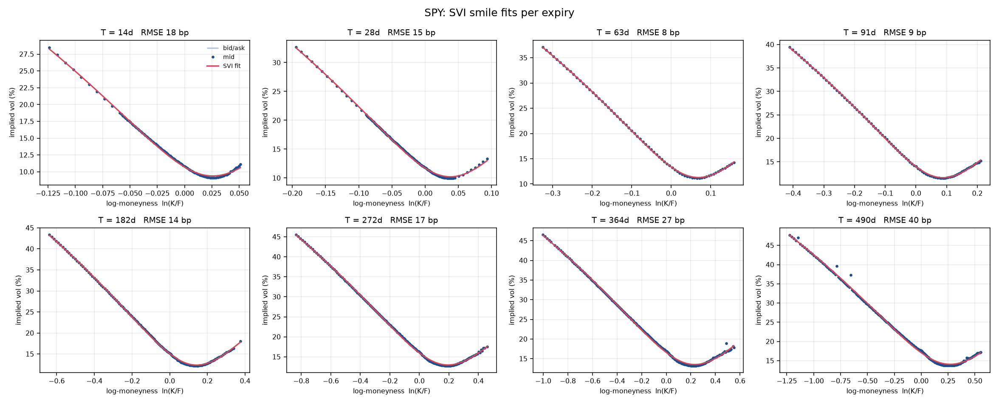
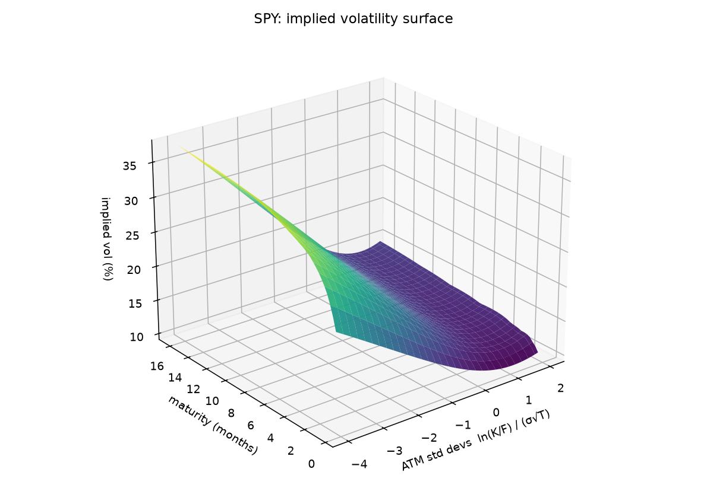

# volsurf

[](https://github.com/omar-r21/volsurf/actions/workflows/tests.yml)

Option pricing and SVI volatility surfaces in Python.

Give it an option chain (strikes, bids, asks) and it gives you back a surface you can query. It pulls
the forward and discount factor out of put-call parity, inverts the quotes to implied vols, fits an SVI
smile to each expiry, and checks the fit for arbitrage.



## Results

SPY, 18 Sep 2026 close (Yahoo, 8 expiries, 1,058 OTM quotes after filtering):

| days | forward | ATM vol | quotes | fit RMSE (bp of vol) |
|---:|---:|---:|---:|---:|
| 14 | 763.96 | 10.7% | 94 | 18 |
| 28 | 765.13 | 11.7% | 123 | 15 |
| 63 | 768.14 | 13.4% | 70 | 8 |
| 91 | 769.78 | 14.0% | 89 | 9 |
| 182 | 776.66 | 15.1% | 129 | 14 |
| 272 | 783.79 | 16.0% | 160 | 17 |
| 364 | 790.98 | 16.6% | 187 | 27 |
| 490 | 800.11 | 17.1% | 206 | 40 |

No butterfly arbitrage on any slice out to |ln(K/F)| = 5, checked on a grid the fit never saw, and no
calendar arbitrage where expiries overlap.

On synthetic quotes built from a known SSVI surface with 20 bp of noise, the fit lands 6 bp from the
truth, so it's averaging the noise rather than chasing it. That's a best case though — SSVI is exactly
representable in SVI and the synthetic calls and puts share a vol, so parity holds perfectly. The SPY
numbers are the honest ones.



## Using it

```python
import pandas as pd
from volsurf import VolSurface

chain = pd.read_csv("data/spy_20260918.csv")        # T, strike, kind, bid, ask
surface = VolSurface.from_chain(chain, spot=761.69, rate=0.0405, min_price=0.05)

surface.implied_vol(K=700, T=0.5)     # 0.1931
surface.price(K=[700, 800], T=0.5, kind="put")
surface.check_arbitrage().ok
surface.summary()                     # forwards, ATM vols, SVI params, fit error per expiry
```

Modules: `black_scholes` (prices and Greeks), `binomial` (CRR tree, American options), `implied_vol`
(the solver), `parity` (forwards), `svi` (the smile model), `arbitrage` (the checks), `surface` (the
pipeline), `synthetic` (chains with a known answer, for tests).

## How it works

**Forwards from parity.** For one expiry, `C(K) - P(K) = D (F - K)` at every strike. With a discount
factor from the T-bill curve, each two-sided strike gives `F = K + (C - P) / D`; the forward is the
median of those near the money. That forward already contains dividends and borrow, so neither needs a
model. You can also let it regress `C - P` on `K` for both D and F, which works on clean synthetic
chains but scatters badly on real SPY quotes, so it warns when the implied rate looks wrong.

**Implied vols from OTM quotes.** Puts below the forward, calls above, everything mapped to its OTM
equivalent by parity before inverting. Deep ITM prices are almost all intrinsic value, so backing the
time value out of them loses precision. The solver is Newton with a bracket around the root; when a
Newton step escapes the bracket (which happens in the wings, where vega underflows) it bisects instead.

**SVI per expiry.** Total variance against log-moneyness, `w(k) = a + b(ρ(k−m) + √((k−m)² + σ²))`. The
wings are linear in k, which is what Lee's moment formula requires, so it extrapolates far better than
a polynomial in strike. Lee's bound `b(1+|ρ|) ≤ 2` is enforced in the fit. Five parameters with several
local minima, so it runs from 18 starts and keeps the best.

**Arbitrage.** A smile is butterfly-free iff the implied density is non-negative, i.e. Durrleman's

    g(k) = (1 − k w′/(2w))² − (w′²/4)(1/w + 1/4) + w″/2 ≥ 0

The fit penalises `g < 0` over the quoted range and out to |k| = 3. Past that Lee's bound covers it:
along a linear wing of slope s, g → 1/4 − s²/16, positive exactly when s < 2. Calendar arbitrage is
checked where two expiries overlap. One of the tests is Vogt's slice from Gatheral & Jacquier — valid-
looking parameters, negative density — which the checker catches.

**Across expiries**, total variance interpolates linearly in T at fixed k, and vol is held flat before
the first and after the last.

## Things that didn't work

- **Forcing calendar consistency during the fit.** I fitted expiries in order and penalised each for
  dipping below the previous one. On SPY it cascaded: short-dated extrapolated call wings shoved every
  later expiry up, and fit error went from ~15 bp to over 1,000. Fitted independently on filtered
  quotes there's no calendar arbitrage anyway, so the constraint was solving a problem the filtering
  had already solved.
- **Weighting by bid/ask width.** SPY spreads are a cent near the money, so inverse-spread weights
  dumped everything on a few ATM strikes and let the wings drift. Uniform weights fit better.
- **Checking arbitrage on the grid the fit was penalised on.** A clean report was basically guaranteed.
  A reviewer found a 2-month slice with negative butterflies just past the last quote. The penalty grid
  now runs well into the wings and the tests check on a separate grid.
- **Measuring time to expiry from `now`.** I pulled a chain on a Saturday and every expiry came out a
  day short, which moved 2-week ATM vol by 35 bp — bigger than the fit error. T now comes from the
  session close the quotes were struck at.
- **Quote filtering beat optimiser tuning.** Dropping mids under 5¢ and strikes past 6 ATM standard
  deviations took short-dated error from ~40 bp to under 20.

## Limitations

- SPY options are American and this treats them as European. OTM quotes and near-the-money parity keep
  the early-exercise premium small, but it isn't modelled. De-Americanising each quote with a tree would
  be the next step, and matters more for single names with big dividends.
- One flat 13-week T-bill rate discounts every expiry.
- Interpolating between two butterfly-free slices isn't guaranteed butterfly-free, and neither is flat
  extrapolation past the last expiry. Arbitrage is checked on the slices, not between them.
- Slices are fitted independently. A global SSVI fit would guarantee consistency at some cost in fit.
- Yahoo data is delayed and not synchronised across strikes. Fine for research, not for trading.

## Running it

```bash
python -m venv .venv && source .venv/bin/activate      # Windows: .venv\Scripts\activate
pip install -e ".[dev,data]"

pytest                                            # 43 tests
python examples/demo.py                           # synthetic surface + plots
python examples/fetch_chain.py SPY                # snapshot a live chain
python examples/demo.py data/spy_YYYYMMDD.csv     # fit and plot it
```

Tests check prices against textbook values, Greeks against finite differences, the binomial tree against
Black-Scholes, implied-vol round trips from 5% to 150% vol, SVI parameter recovery, Vogt's arbitrage
example, and end-to-end recovery of a known surface from noisy quotes.

## References

- Gatheral (2004), *A parsimonious arbitrage-free implied volatility parameterization.*
- Gatheral & Jacquier (2014), *Arbitrage-free SVI volatility surfaces.* Quantitative Finance 14(1).
- Lee (2004), *The moment formula for implied volatility at extreme strikes.* Mathematical Finance 14(3).
- Cox, Ross & Rubinstein (1979), *Option pricing: a simplified approach.* JFE 7(3).
